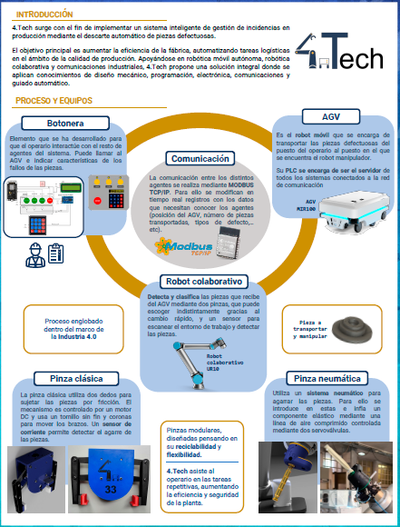

# Ingenia_2023
**ETSII Ingenia 2023 Project** 

Este repositorio pertenece al equipo **4.Tech** de la asignatura [_INGENIA: Diseño de sistemas inteligentes con robots y AGV_](http://fabricacion.industriales.upm.es/ingenia/). Se trata de un grupo siete alumnos del Master en Ingeniería Industrial impartido en la ETSII-UPM.

![]{width='300px' height='200px'}(./Documentacion/logo_4Tech.jpg)

# Descripción del proyecto
El objetivo de este repositorio es almacenar todo el código involucrado en el desarrollo del proyecto de la asignatura. La asignatura busca diseñar e implentar un proceso de fabricación y logística automatizada desde sus etapas tempranas de diseño conceptual hasta la automatización de procesos complejos como la selección de piezas o el transporte de materiales.

El proceso de fabricación implica el trabajo conjunto de un brazo robot colaborativo _UR Polyscope 5_, una plataforma móvil inteligente AGV (_MiR 100_) y una estación de fabricación (CNC, inyectora, impresora 3D, etc.). La diversidad de herramientas y su transversalidad en el proyecto implican que la asignatura se divida en dos bloques principales:
    - Diseño de componentes mecánicos y electrónicos que permitan la innteracción entre el operario y los equipos colaborativos.
    - Adquisición de datos y toma de medidas para que el humano pueda tomar decisiones y potimizar el proceso.

## El problema
Se desea implementar un sistema de fabricación automatizado. En este caso el sistema debe contar con una interfaz hombre-máquina a través de la cual un operario en planta detecta una pieza defectuosa y llama a su posición al AGV MiR 100. El AGV se dirigirá al puesto del operario y esperará hasta que éste lo cargue con los elementos defectuosos y le indique con la interfaz hombre-máquina las instrucciones a seguir.

Con las instrucciones ya cargadas en su interior, el AGV se dirigirá a la estación del robot UR. Una vez ha llegado el AGV, el UR será el responsable de interpretar la información en el interior del AGV, tomando cada pieza y deositándola en una estación de trabajo según le haya sido indicado.

Para facilitar la comunicación entre el AGV y el UR, se ha diseñado una unidad de control (UC). Es decir, una placa microcntroladora responsable de monitorizar las señales de accionamiento del UR, el principio y fin de la operación de recogida de piezas entre el AGV y el UR; y el estado de los sistemas _UR_ y _AGV_.

El proyecto ha diseñado dos pinzas adaptadas al robot colaborativo UR: una pinza clásica de dos dedos y una pinza neumática con capacidad de inflado y agarre por fricción. La pinza clásica está accionada por un motor de corriente continua, mientras que la pinza neumáticafunciona a través de un sistema de válvulas de aire comprimido. Ambas pinzas han sido diseñadas desde cero por el equipo 4.Tech y son intercambiables entre sí, favoreciendo el libre funcionamiento de la estación del UR.

# Composición del repositorio
El repositorio consta de cuatro bloques de programación principales. Cada bloque se corresponde a un equipo diferente y emplea sus propias herramientas de control y programación.

- **Botonera:** Es el dispositivo que emplea el operario para llamar al AGV y encargarle qué misión debe cumplir. Así como también el tipo de piezas que lleva, cuantas son, a dónde debe dirigirse o alguna información que se debe tener en cuenta (material, posición de las piezas y código de errores).
- **Ensayos:** La pinza clásica está accionada a través de un motor de corriente continua y controlado a través de un driver responsable de regular el flujo de corriente necesario para su apertura y cierre. Este directorio almacena todo el código referente a las pruebas de contacto, control y diseño de este sistema de regulación.
- **UC:** Este directorio guarda todo el código de la unidad de control. Es decir toda la asignación de responsabilidades y el reparto de operaciones de inspección, comunicación de instrucciones AGV-UR y cambio de registros de ambos dispositivos
- **UR:** Es todo el código de control del robot colaborativo. Incluye los scripts de operaciones internas como el posicionamiento, el barrido, el cambio de pieza o la carga/descarga de piezas.

